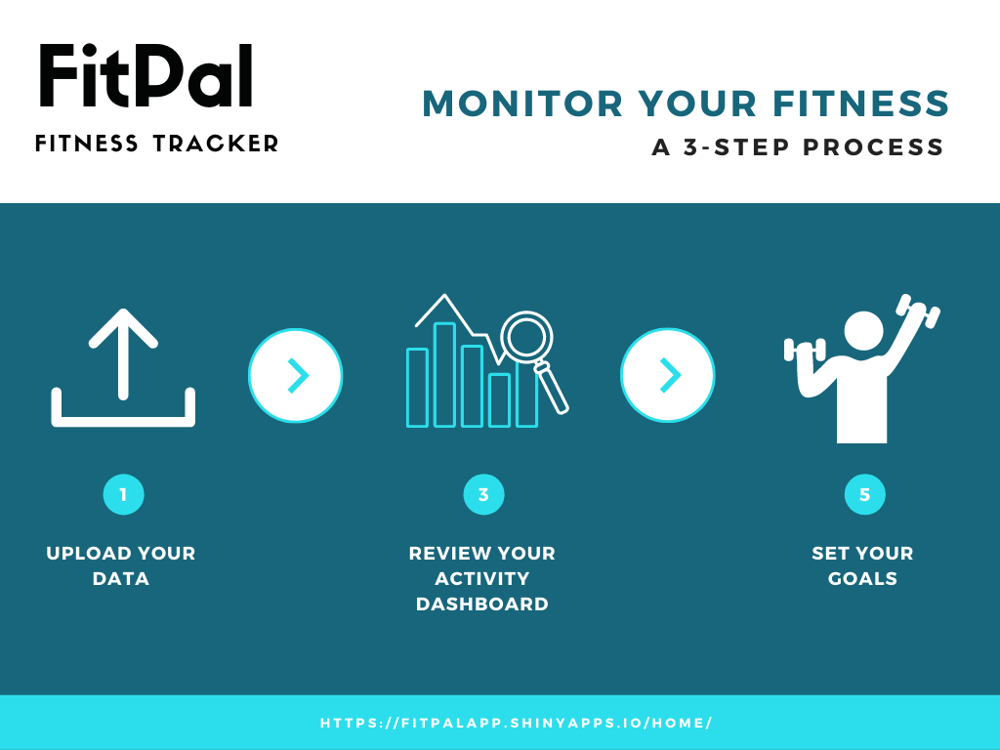

# MGMT 590-URA (Using R For Analytics) - FitPal: A Fitness Tracker

This repo contains the code for final project in the Summer 2021 edition of MGMT 590-URA (Using R For Analytics) namely FitPal App . 
## Outline

- Part 1 - Overview 

- Part 2 - Architecture

- Part 3 - Steps to Use App

- Part 4 - Access the deployed App

- Part 9 - Dependencies

- Part 10 - Create and Manage Secrets in Pachyderm

- Part 11 - Running the commands in pachctl


## 1.Overview 


We have created an app that displays health data, predicts whether the user will meet their fitness goals, and prescribes recommendations on how to obtain those goals based on the user’s progress. The health and fitness industry is one of the world’s largest and fastest growing. This app uses data to allow consumers to set and meet their goals and allows us to capitalize on the demand for fitness technology. We created this app by intaking consumer data as tracked on their fitness device (Fitbit, Apple Watch, etc.) and we use R’s Shiny package to display their fitness progress.   We have created an app that displays health data, predicts whether the user will meet their fitness goals, and prescribes recommendations on how to obtain those goals based on the user’s progress. The health and fitness industry is one of the world’s largest and fastest growing. This app uses data to allow consumers to set and meet their goals and allows us to capitalize on the demand for fitness technology. We created this app by intaking consumer data as tracked on their fitness device (Fitbit, Apple Watch, etc.) and we use R’s Shiny package to display their fitness progress.   

## 2.Architeture


The app is divided into two sections UI code and the server code. The UI code is written in pure HTML,CSS and Javascript while the server code is written in R. Finally, the app is deployed over R shiny server.
# 3.Steps to Use App



The app can be accessded easily using the 3 simple steps shown in the image

## 4.Access the deployed App 

The deployed app is accessible at https://fitpalapp.shinyapps.io/home/

## DEPENDENCIES:

```python

library(shinythemes)
library(shiny)
library(shinyWidgets)
library(shinydashboard)
library(dashboardthemes)
library(dplyr)
library(DT)
library(ggplot2)
library(XML)
library(reshape2)
library(lubridate)
library(scales)
library(ggthemes)
library(ggrepel)
library(plotly)
library(readxl)
library(bslib)
library(writexl)
library(tidyr)
```

